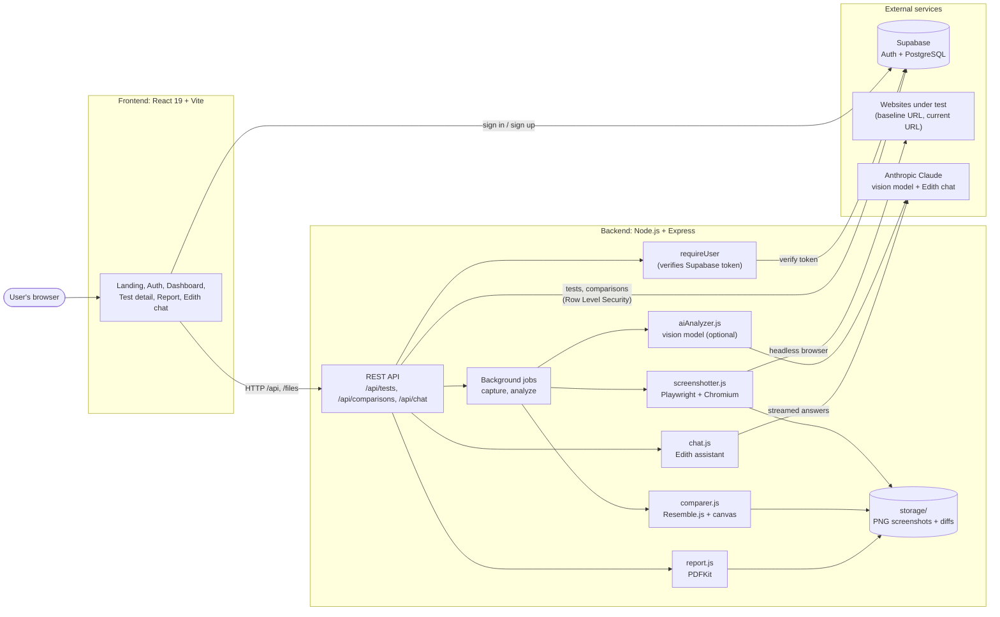
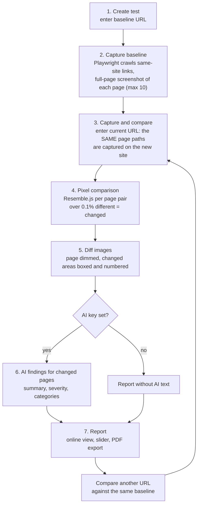

# VisuGuard

**Live: [https://visu-guard.vercel.app/](https://visu-guard.vercel.app/)**

**Visual regression testing for websites.** Save one approved version of your site (the *baseline*), then compare any new deployment against it, page by page. VisuGuard shows exactly what changed, how much, and (optionally) describes the change in plain words with AI.

- Full-page screenshots of every page, captured with Playwright
- Pixel-by-pixel comparison with Resemble.js (a page counts as changed above **0.1%** of pixels)
- Readable diff images: the page is dimmed and every changed area is spotlighted in a numbered red box
- Optional AI findings per changed page: summary, severity, categories, observations
- Interactive report with a before/after slider, comparison history and PDF export
- **Edith**, a built-in chat assistant (Anthropic Claude) that answers questions about the app
- Accounts with email/password or Google sign-in. Each user only sees their own tests (Supabase Row Level Security).
- Rate-limited API: a generous per-IP limit on every request, a stricter per-user limit on Playwright/AI jobs.

---

## Architecture



### Test workflow



---

## Tech stack

| Layer | Technology |
|---|---|
| Frontend | React 19, Vite, Tailwind CSS v4, Framer Motion, Lucide icons |
| Backend | Node.js (18+), Express 5 |
| Screenshots | Playwright (headless Chromium) |
| Comparison | Resemble.js, node-canvas (diff drawing) |
| Auth and database | Supabase (Auth, PostgreSQL, Row Level Security) |
| AI findings (optional) | Anthropic vision model via `@anthropic-ai/sdk` |
| Edith assistant | Anthropic Claude via `@anthropic-ai/sdk` (streamed responses) |
| PDF reports | PDFKit |

---

## Project structure

```
.
├── backend/
│   ├── server.js            Express app, routes, static /files
│   ├── auth.js              requireUser middleware (Supabase token check)
│   ├── supabase.js          per-user Supabase client
│   ├── screenshotter.js     baseline crawl + current capture (Playwright)
│   ├── comparer.js          pixel comparison + diff drawing (Resemble.js)
│   ├── aiAnalyzer.js        optional AI description of changed pages
│   ├── comparisons.js       archive of older comparisons
│   ├── report.js            PDF report (PDFKit)
│   ├── edithKnowledge.js    what Edith knows
│   └── routes/              tests.js, comparisons.js, chat.js
├── frontend/
│   ├── src/
│   │   ├── pages/           Landing, Auth, Dashboard, TestDetail, ResetPassword
│   │   ├── components/      report, capture steps, Edith chat, UI kit
│   │   └── api.js           API client (incl. streamed chat)
│   └── public/              static images
└── demo-sites/              two small sites to try VisuGuard without a real website
```

---

## Getting started

### Prerequisites

- Node.js 18 or newer
- A free [Supabase](https://supabase.com) project

### 1. Set up Supabase

1. Create a project.
2. **Authentication → Providers:** enable Email. For local testing you may turn off "Confirm email".
3. **Authentication → URL Configuration:** Site URL `http://localhost:5173`, redirect URL `http://localhost:5173/**`.
4. *(Optional)* Enable the Google provider with an OAuth client from Google Cloud. Use your Supabase callback URL `https://<project-ref>.supabase.co/auth/v1/callback` as the authorized redirect URI.
5. In the **SQL editor**, run:

```sql
create table tests (
  id             uuid primary key default gen_random_uuid(),
  user_id        uuid not null references auth.users(id) on delete cascade,
  baseline_url   text not null,
  current_url    text,
  status         text not null default 'created',
  error_message  text,
  baseline_pages jsonb,
  current_pages  jsonb,
  results        jsonb,
  pages_tested   int,
  pages_changed  int,
  avg_mismatch   numeric,
  created_at     timestamptz not null default now()
);

alter table tests enable row level security;

create policy "users manage their own tests"
  on tests for all
  using (auth.uid() = user_id)
  with check (auth.uid() = user_id);

create table comparisons (
  id            uuid primary key default gen_random_uuid(),
  test_id       uuid not null references tests(id) on delete cascade,
  user_id       uuid not null references auth.users(id) on delete cascade,
  current_url   text not null,
  current_pages jsonb,
  results       jsonb,
  pages_tested  int,
  pages_changed int,
  created_at    timestamptz not null default now()
);

create index comparisons_test_id_idx on comparisons (test_id);

alter table comparisons enable row level security;

create policy "users manage their own comparisons"
  on comparisons for all
  using (auth.uid() = user_id)
  with check (auth.uid() = user_id);
```

### 2. Configure environment variables

```bash
cp backend/.env.example backend/.env
cp frontend/.env.example frontend/.env
```

**`backend/.env`**

| Variable | Required | Description |
|---|---|---|
| `SUPABASE_URL` | yes | Supabase project URL |
| `SUPABASE_ANON_KEY` | yes | Supabase anon (public) key |
| `PORT` | no | Server port, default `3001` |
| `MAX_PAGES` | no | Pages captured in a baseline crawl, default `10` |
| `AI_API_KEY` | no | Anthropic key. Enables AI findings and the Edith chat assistant. Leave empty to run without either |
| `AI_MODEL` | no | Vision model for findings, default `claude-sonnet-5` |
| `AI_TIMEOUT_MS` | no | Per-request AI timeout, default `90000` |
| `EDITH_MODEL` | no | Chat model for Edith, default `claude-haiku-4-5-20251001` |

**`frontend/.env`**

| Variable | Description |
|---|---|
| `VITE_SUPABASE_URL` | Supabase project URL |
| `VITE_SUPABASE_ANON_KEY` | Supabase anon (public) key |

API keys stay in the backend. Never put them in the frontend.

### 3. Install and run

```bash
# Backend (http://localhost:3001)
cd backend
npm install
npx playwright install chromium
npm run dev

# Frontend (http://localhost:5173), in a second terminal
cd frontend
npm install
npm run dev
```

In development, Vite proxies `/api` and `/files` to the backend, so no CORS setup is needed.

### 4. Try it with the demo sites

Two tiny demo sites exist so the pipeline can be shown without a real website. They're also deployed publicly, so they work against the live app too, not just local dev (a locally-run backend can't reach a deployed backend's `localhost`, and vice versa):

```bash
cd demo-sites
node server.js
```

| Site | Local URL | Live URL | Use as |
|---|---|---|---|
| baseline | http://localhost:4100 | https://demobaseline.vercel.app | Baseline URL |
| changed | http://localhost:4101 | https://demochanged.vercel.app | Current URL |

1. Sign in and click **Start New Test**. Enter the baseline URL (local or live, matching where you're running the app).
2. Click **Create Baseline**, then **Capture Baseline**.
3. Enter the changed URL and click **Capture & Compare**. The report opens by itself.
4. Click a screenshot to enlarge it, use the slider to compare, click **Export PDF**.
5. Click **Compare Another URL** and enter the baseline URL again: an identical site, so nothing changes, and both reports appear in the history.

Expected result (values can differ slightly by machine because of fonts):

| Page | Change | Result |
|---|---|---|
| `/` | New heading, larger hero, orange colours, button moved | changed, about 62% |
| `/about` | One sentence is longer | changed, about 2% |
| `/services` | Four cards in one column instead of two | changed, about 17% |
| `/contact` | Bigger orange button | changed, about 1.6% |
| `/team` | Identical | unchanged, 0% |
| `/careers` | Longer job listing text, added a call-to-action button | changed, about 1.7% |

---

## How it works

**Baseline capture.** Playwright opens the start URL in headless Chromium (1280x720), follows links on the same site (breadth first, no files, no `mailto:`, no duplicates) and takes a full-page screenshot of up to `MAX_PAGES` pages. It scrolls through each page for lazy images, waits for fonts and disables animations, so captures are stable. The baseline stays saved until the test is deleted.

**Current capture.** No crawling. VisuGuard visits the *same paths* the baseline found, on the new host. A page that redirects elsewhere or does not exist is reported as unavailable, never silently skipped.

**Comparison.** Resemble.js compares each baseline/current pair (anti-aliasing ignored). A page is `changed` when more than 0.1% of pixels differ. For changed pages, the diff image shows the current page dimmed to grey, with nearby changes merged into areas that are shown in full colour inside numbered red boxes.

**AI findings (optional).** For each changed page, a vision model receives the baseline, the current screenshot and the diff image, and returns a validated summary, severity (low to critical), categories, observations and a confidence value. The AI never decides whether a page changed. Without a key, the report says so and everything else works.

**Jobs.** Captures and analyses run on the server in the background and report live progress. You can close the tab and return. A job interrupted by a server restart is marked failed, with a Try Again button.

**Edith.** A chat assistant in the corner of the app. Answers stream in as they are written, the conversation can be deleted from the chat header, and the backend rate-limits requests. It only answers questions about VisuGuard.

---

## API

All `/api/tests` and `/api/comparisons` routes require `Authorization: Bearer <Supabase access token>`.

| Method | Route | Purpose |
|---|---|---|
| `GET` | `/api/health` | Health check |
| `GET` | `/api/tests` | List my tests |
| `POST` | `/api/tests` | Create a test `{ baselineUrl }` |
| `GET` | `/api/tests/:id` | One test plus live job progress |
| `DELETE` | `/api/tests/:id` | Delete a test and its files |
| `POST` | `/api/tests/:id/capture-baseline` | Start the baseline capture |
| `POST` | `/api/tests/:id/capture-current` | Capture the new version `{ currentUrl }` |
| `POST` | `/api/tests/:id/analyze` | Compare baseline and current |
| `POST` | `/api/tests/:id/retry-ai` | Ask the AI again for changed pages |
| `GET` | `/api/tests/:id/comparisons` | Older comparisons of a test |
| `GET` | `/api/tests/:id/report.pdf` | Download the PDF report |
| `GET` | `/api/comparisons/:id` | One older comparison |
| `GET` | `/api/comparisons/:id/report.pdf` | PDF of an older comparison |
| `POST` | `/api/chat` | Edith (streamed text response) |
| `GET` | `/files/...` | Screenshot and diff images |

Test statuses: `created`, `capturing_baseline`, `baseline_captured`, `capturing_current`, `current_captured`, `analyzing`, `completed`, `failed`.

---

## Deployment

**Backend (Railway, Docker).** Deployed from `backend/Dockerfile` (Node 22, Chromium + canvas system libraries installed at build time). Root directory `backend`, a persistent volume mounted at `/app/storage` (screenshots are lost on restart otherwise), and the backend environment variables above set in the service's Variables tab. `backend/railway.json` pins the build path and the `/api/health` health check. A `render.yaml` is also kept in the repo root as an alternative if deploying to Render instead.

**Frontend (Vercel).** Project root `frontend`, the two `VITE_*` variables set, and `frontend/vercel.json` forwards `/api/*` and `/files/*` to the backend:

```json
{
  "rewrites": [
    { "source": "/api/:path*", "destination": "https://<your-backend>.up.railway.app/api/:path*" },
    { "source": "/files/:path*", "destination": "https://<your-backend>.up.railway.app/files/:path*" }
  ]
}
```

Then add the Vercel domain to Supabase under **Authentication → URL Configuration** (Site URL and redirect URLs).
